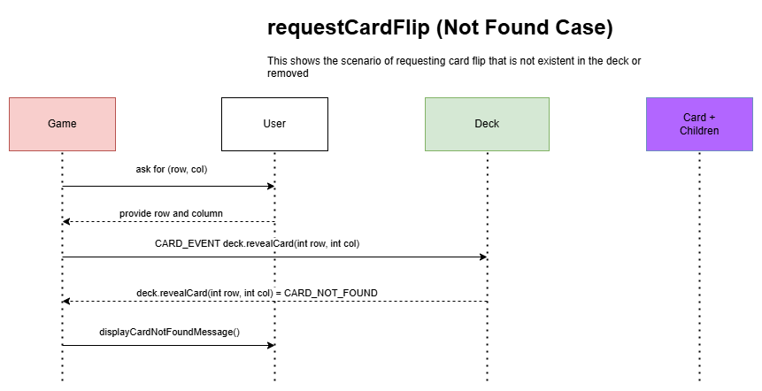
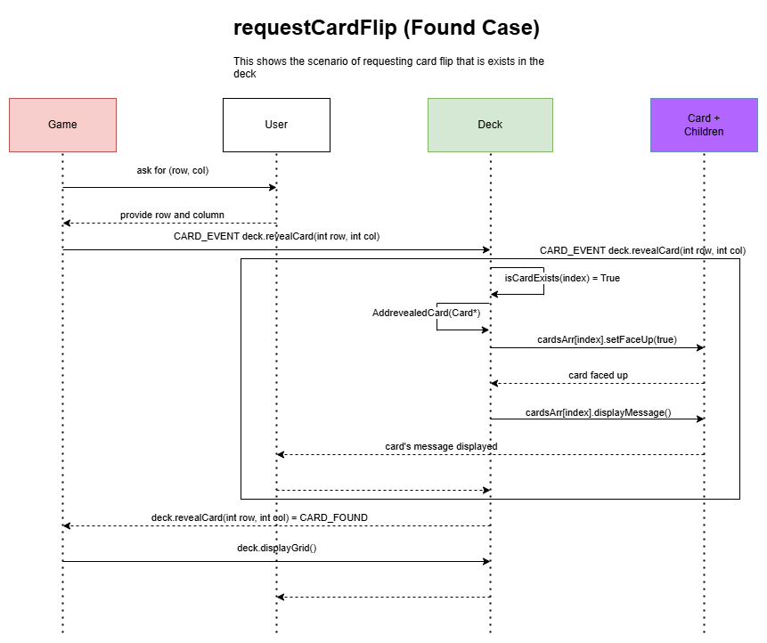

# Project Documentation

# Preface

This is a C++ implementation for the **MMemory Match Card Game**, the Programming III (INCS101) Course Project for Winter 2024/2025 at the **G**erman **I**nternational **U**niversity of **A**pplied **S**ciences (**GIUAS**). This will include the source code in addition to the project's documentation.

# Objective

This project uses object-oriented programming principles to create a  C++ console application to implement the MMemory Matchcard game. The game challenges players to find matching pairs of cards from a shuffled deck. Players take turns flipping cards to reveal their values, aiming to collect as many matching pairs as possible.

# Project Overview

The Memory Match game is a two-player card game where players try to match pairs of cards from a shuffled deck laid out in a grid. On each turn, a player flips two cards face-up. If the cards match, the player scores points and takes another turn. If the cards don’t match, they are flipped face-down again, and the next player gets a turn. The player who finds the most pairs of matching cards wins the game. The players must remember the locations of previously revealed cards to increase their chances of finding matches on subsequent turns.

# Game Features and Specifications

The project will include the following features:

1. Card Management: A class that defines the cards’ numbers, types and states (face-up or face-down).
2. Deck Management: A class to manage the deck of cards and each card’s state (face-up
or face-down). Also, it is responsible for displaying the grid on the console.
3. Player Management: A class to manage the player’s attributes. For example, the name, the current score and number of allowed turns.
4. Game Management: A class that uses player and deck classes to implement the game logic. It initializes the game, manages players to take turns flipping cards and determines the winner when the game ends.

## Cards

There are three types of cards in the project; Standard, Bonus and Penalty Cards

1. **Standard Card**: This represents the normal cards (digits between 1 and 6 inclusive). This card has no special abilities. If a player flips two standard cards (i.e. having the same number), he/she scores one point and takes another turn.
2. **Bonus Card**: This card has a number 7. If a player flips a bonus card, he/she will get an extra point or a bonus turn. 
3. **Penalty Card**: This card has a number 8. If a player flips a penalty card, he/she loses a point or skips their next turn.

## Deck

The deck consists of 8 card pairs; 6 pairs of standard cards (numbered from 1 to 6), a pair of Bonus Cards and a pair of Penalty Cards. The Deck class is responsible for displaying the cards on the console and shuffling them at the start of the game. Also, it is responsible for receiving the card reveal requests from the player and handling it correctly. Finally, it determines the revealed card types and triggers the suitable event.

## Players

The game is designed for 2 players. Each player has a name, score and number of allowed turns.

## Game

The game class should handle the game flow from start to end. It consists of two players, a deck and a mechanism for handling turns. The game flow is explained in the following section.

# Game Sequences

## Start of Game

1. The user enters the names of the two players and decides which player will start
2.  The deck is shuffled, and the cards are laid out face-down in the grid.

## Player’s Turns and Actions Rules

On their turn, a player flips two cards face-up. The player selects two cards from the grid by entering their coordinates (x, y), corresponding to the respective row and column indices. The coordinates have a range from 1 to 4. The selected cards are flipped and revealed to both players. The revealed card types determine who will play according to the following cases:

1. If the current player reveals two different standard cards, the current player’s turn ends and the next player’s turn should start. The two revealed cards are hidden again in the next turn.
2. If the current player reveals two same standard cards, the current player’s turn is continued with an increased score and the two cards are removed from the grid.
3. If the current player reveals a standard card and a bonus card, the current player’s turn ends and the flipped bonus card is removed from the grid.
4. If the current player reveals a standard card and a penalty card, the current player’s turn ends and the flipped penalty card is removed from the grid.
5. If the current player reveals a bonus card and a penalty card, the current player’s turn ends and the flipped cards are removed from the grid.
6. If the current player reveals two bonus cards, the player should choose from two options. The first choice is to end the turn while gaining two points. The other option is to gain only 1 point and continue his turn. In both options, the two bonus cards are removed from the grid.
7. If the current player reveals two penalty cards, the player should choose from two options. The first choice is to end the turn while losing two points. The other option is to lose only 1 point while skipping his next turn (i.e. the next player will play two successive rounds). In both options, the two penalty cards are removed from the grid.

## Scoring Rules

The revealed cards determine whether the current player will gain or lose points according to the following rules.

1. If the current player reveals two different standard cards, the current player’s score is unchanged.
2. If the current player reveals two same standard cards, the current player gains 1 point.
3. If the current player reveals a standard card and a bonus card, the current player gains 1 point.
4. If the current player reveals a bonus card and a penalty card, the current player’s score is unchanged.
5. If the current player reveals a standard card and a penalty card, the current player loses 1 point.
6. If the current player reveals two bonus cards, the player should choose from two options. The first choice is to end the turn while gaining two points. The other option is to continue his turn while gaining only 1 point.
7. If the current player reveals two penalty cards, the player should choose from two options. The first choice is to end the turn while losing two points. The other option is to lose only 1 point while skipping his next turn.

## Game End

The game continues as long as there are un-flipped cards on the grid. Each player takes a turn, collects points and removes the cards from the grid. The game ends when all cards are removed from the grid. The player with the highest score is declared the winner. If both players have the same score, the game will end in a tie, and the result will be announced accordingly.

# Project Architecture and Implementation

## Project Architecture and Class Diagram

The project consists of the following classes according to the above specifications. The class's methods and functionality are explained thoroughly in the following sections.

.png)

Fig. 1. Project’s Class Diagram

## Player Class

### Attributes

The player class has the following `private` attributes; `string name`, `int score` and `int turnsNo`. The name and score represent the player’s name and score. On the other hand, `turnsNo` keeps track of the number of available turns for each player.

### Methods

1. `Player()`: The default constructor that initialises its name to an empty string, its score to zero and `turnsNo` to zero.
2. `Player(string name, int score)`: Another constructor that sets the name and score according to the input values.
3. `~Player()`: A default destructor.
4. Getters and setters for `name` i.e. `void setName(string name)` and `string getName()` .
5. Getters and setters for `turnsNo` i.e. `void setTurnsNo(int turns)` and `int getTurnsNo()` .
6. Getters and setters for `score` i.e. `void setScore(int score)` and `int getScore()` .
7. `void displayScore()`: displays the player’s name with the corresponding score in the console.
8. `void updateScore(int n)`: update the player’s score by incrementing it by n points.
9. `void incrementTurn()`: that increments the player’s turn by one.
10. `void decrementTurn()`: that decrements the player’s turn by one.

## Card Class

### Overview

The card class is the parent class of the different card types in the game (Standard, Bonus and Penalty). It includes the basic functionality of the cards.

### Public enumerations

Inside the `card.h` file, `enum CARD_TYPE_T` is defined to represent the possible card types. that includes `{DEFUALT, STANDARD, BONUS, PENALTY}` . The `DEFAULT` is only used for initialization for card objects and used for testing purposes.

### Attributes

The Card class has the following `protected` attributes; `int number`, `bool faceUp` and `CARD_TYPE_T cardType`. Standard cards should have numbers between 1 and 6, while Bonus and Penalty cards should have numbers 7 and 8 respectively. `faceUp` tracks the card state whether it is faced up or down.

### Methods

1. `Card(int number, bool isFaceUp)`: sets the card type to `DEFAULT` 
2. `virtual ~Card()` : the destructor is made virtual to allow the compiler to check for the dynamic type upon deleting the object.
3. Getters and setters for `number` i.e. `void setNumber(int number)` and `int getNumber()` .
4. Getters and setters for `faceUp` i.e. `void setFaceUp(bool faceUp)` and `bool isFaceUp()` .
5. Getter for `cardType` i.e. `CARD_TYPE_T getCardType()`.
6. `display()` that displays the card’s data according to its state. The function will display the card’s number if it is faced-up. Otherwise, it will display an `*`.
7. `virtual void displayMessage() = 0`. This allows the card class to be abstract and cannot be instantiated. This function will display the card’s message according to its dynamic type.

## `StandardCard` Class

### Methods

`StandardCard(int number, bool faceUp)`: calls the card constructor and sets the card type to `STANDARD`.

`displayMessage()`: A function that prints `Standard Card <Card Number> is revealed` once it is called.

## `BonusCard` Class

### Methods

`BonusCard(int number, bool faceUp)`: calls the card constructor and sets the card type to `BONUS`.

`displayMessage()`: A function that prints `Bonus Card is revealed` once it is called.

## `PenaltyCard` Class

`PenaltyCard(int number, bool faceUp)`: calls the card constructor and sets the card type to `PENALTY`.

`displayMessage()`: A function that prints `Penalty Card is revealed` once it is called.

## Deck Class

### Public Enumerations

In the `Deck.h` file, `enum CARD_EVENT_T`, `enum REVEALED_CARDS_EVENT_T`, `enum DECK_STATUS_T` represent card and deck events.

1. `enum CARD_EVENT_T` represents the possible card request results. This includes `{CARD_FOUND, CARD_REVEALED_BEFORE, CARD_NOT_FOUND}`.
2. `enum REVEALED_CARDS_EVENT_T` represents the possible revealed card outcomes. `{TWO_SAME_STANDARD, TWO_DIFFERENT_STANDARD, TWO_PENALTY, TWO_BONUS, STANDARD_AND_BONUS, STANDARD_AND_PENALTY, BONUS_AND_PENALTY}` .
3. `enum DECK_STATUS_T` represents the possible Deck states `{EMPTY_DECK, ONE_CARD_LEFT, TWO_OR_MORE_CARDS_LEFT}` 

### Attributes

1. Inside the deck class, define the `int removedCards` that stores the number of removed cards in the deck
2. Inside the deck class, define the `int revealedCardsIndex[2]` that stores the index of the revealed cards from the deck. Initially, the array should store -1 in its indices.

### Methods

1. `Deck::Deck()`: Initialises the deck by creating six pairs of standard cards, a pair of bonus and penalty cards. Also, it sets `revealCardsIndex` array to -1.
2. `Deck::~Deck()` check for each element in the `cardsArr` array that the pointer is not a `nullptr` before deleting.
3. `Deck::displayGrid()`: it should check that the card pointer is not a `nullptr` before the calling its display method. If the card pointer is a `nullptr`, it should print a space `“ “` .
4. `bool Deck::isCardExists(int index)`: it is an inline function that checks whether the card pointer saved in `index` is a null pointer.
5. `DECK_STATUS_T Deck::getDeckStatus()`: it is an inline function that checks the deck’s status using `removedCards` 
    1. if `removedCards==DECK_SIZE-1` , then only one card remains in the deck and should return `ONE_CARD_LEFT` 
    2. if `removedCards==DECK_SIZE` , then the deck is empty and should return `EMPTY_DECK TWO_OR_MORE_CARDS_LEFT` 
    3. if `removedCards < DECK_SIZE-1` , then the deck has more than two cards unflipped and should return `TWO_OR_MORE_CARDS_LEFT`
6. `CARD_EVENT_T Deck::revealCard(int row, int col)`: converts `row` and `col` to index. `row` and `col` have values between 1 and `GRID_SIZE` inclusive. It calls `revealCard(int index)`.
7. `CARD_EVENT_T Deck::revealCard(int index)`: It uses the `isCardExists(int index)` to check if the card is available. If it is not available, the function should return `CARD_NOT_FOUND`. If the card is available but faced-up (i.e. revealed before), it should return `CARD_REVEALED_BEFORE`.
    
    If the card is available and not revealed before,
    
    1.  reveal the card
    2. add the card to revealedCardsIndex
    3. display the card message
    4.  the function should return `CARD_FOUND` 
8. `REVEALED_CARDS_EVENT_T Deck::evaluateFlippedCards()`

_flowchart.drawio.png)

evaluateFlippedCards() flowchart

This function in `Deck`class should determine both card types and return a `REVEALED_CARDS_EVENT_T` `enum` based on their type according to the above flowchart.

1. Two Similar Standard Cards Case:
    1. remove both cards from the `cardsArr` using `revealedCardsIndex`
    2. increment `removedCards` by 2
    3. return `TWO_SAME_STANDARD` 
2. Two Penalty Cards Case:
    1. remove both cards from the `cardsArr` using `revealedCardsIndex`
    2. increment `removedCards` by 2
    3. return `TWO_PENALTY` 
3. Two Bonus Cards Case
    1. remove both cards from the `cardsArr` using `revealedCardsIndex`
    2. increment `removedCards` by 2
    3. return`TWO_BONUS` 
4. A Bonus Card and a Penalty Card 
    1. remove both cards from the `cardsArr` using `revealedCardsIndex`
    2. increment `removedCards` by 2
    3. return `BONUS_AND_PENALTY` 
5. A Standard Card and a Bonus Card Case:
    1. remove the bonus card from the `cardsArr` using `revealedCardsIndex` 
    2. flip the standard card (i.e. setFaceUp(false))
    3. increment `removedCards` by 1
    4. return `STANDARD_AND_BONUS` 
6. A Standard Card and a Penalty Card Case:
    1. remove the penalty card from the `cardsArr` using `revealedCardsIndex` 
    2. flip the standard card (i.e. setFaceUp(false))
    3. increment `removedCards` by 1
    4. return `STANDARD_AND_PENALTY` 
7. Two Different Standard Cards Case:
    1. flip the standard cards (i.e. setFaceUp(false))
    2. return `TWO_DIFFERENT_STANDARD` 

In all cases, set the card indices in `revealedCardsIndex` array to -1

1. `CARD_TYPE_T revealLastCard()` : searches for the last card and reveals it using 
    
    `CARD_EVENT_T Deck::revealCard(int index)`
    

## Game Class

### Public Enumerations

In the `Game.h` file, `enum GAME_STATE_T` and `enum TURN_STATE_T` represent various game states and turn events.

1. `enum GAME_STATE_T` represent the different game states
    
     `{GAME_CREATED, GAME_START, GAME_LOOP, GAME_END}` 
    
2. `enum TURN_STATE_T` that represents the possible outcome of each turn 
    
    `{BONUS_TURN, SKIP_TURN, END_TURN}` 
    

### Attributes

1. Inside the `Game` class, define `GAME_STATE_T gameState` that tracks the game’s state
2. Inside the `Game` class, define the `int currentTurn` that corresponds to the current player’s index in `players[2]`.
3. Inside the `Game` class, define the `int nextTurn` that corresponds to the next player’s index in `players[2]`.

### Methods

`Game::Game()` 

1. Initializes `currentTurn` and `nextTurn` to -1
2. Sets the `gameState` to `GAME_CREATED`

`Game::intializeGame()`

1. Ask the user which player will start
2. Sets this player’s index to the current player and the other one to the next player
3. Increment the turn of the current player in `players[2]` 
4. Sets the `gameState` to `GAME_START`

`void Game::requestCardFlip()` 

_flowchart.drawio.png)

1. If a card was already removed or flipped, the function would ask the user for a different row and column. 
2. If the indices are not within the range, it should prompt the user for a different row and column

`TURN_STATE_T Game::evaluateTurn(int& score_ref)`

This function in `Game` class should determine turn types and return a `TURN_STATE_T` based on their type.

_flowchart.drawio.png)

`GAME_STATE_T Game::takeTurn()`

This function in `Game` class should determine the game states and return a `GAME_STATE_T` based on their corresponding state.

_flowchart.drawio.png)

`void Game::finalizeGame()` 

_flowchart.drawio.png)

`void flipLastCard(int& score_ref)` 

_flowchart.drawio.png)

`GAME_STATE_T Game::shiftTurn()` 

`void Game::loopGame()` 

# Sequence Diagrams

## requestCardFlip() diagram: Not found Case

## requestCardFlip() diagram: Found Case

## flipLastCard(int& score_ref) diagram

_Sequence_Diagram.drawio.png)
